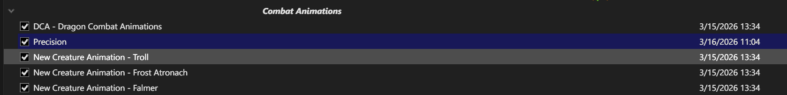
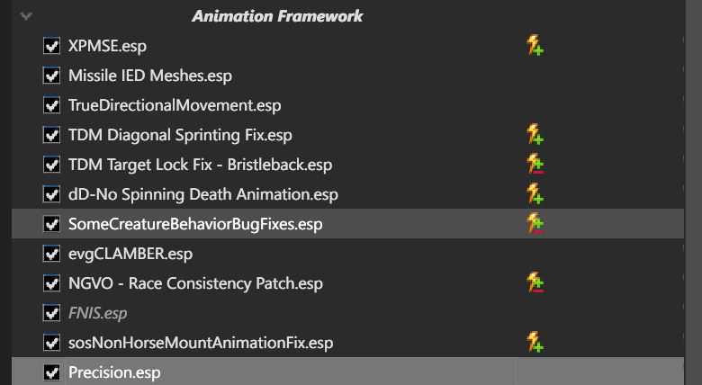
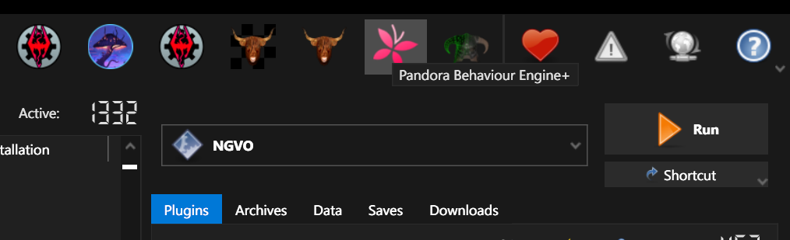
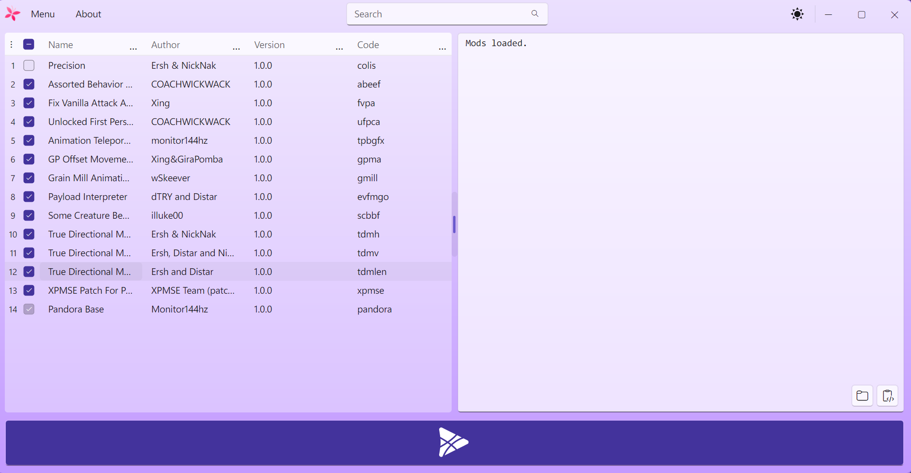
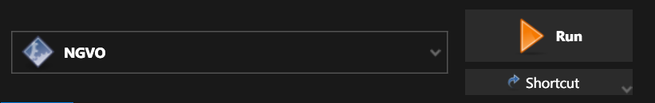

# Instalacja Precision w NGVO

Krótka instrukcja dla konfiguracji:

- NGVO
- Mod Organizer 2
- Precision - Accurate Melee Collisions
- Pandora Behaviour Engine Plus

## Pre-install

1. W MO2 pracuj na osobnym profilu, np. `ngvo + precision`.
2. Upewnij się, że na liście są już wymagania Precision:
   - `SKSE`
   - `Address Library for SKSE Plugins`
   - `SkyUI`
   - `MCM Helper`
3. Upewnij się, że w tej liście jest `Pandora Behaviour Engine Plus`.
4. Nie zakładaj z góry workflow z Nemesis. W tej konfiguracji końcowy krok robi Pandora.

## Instalacja

1. Pobierz mod `Precision - Accurate Melee Collisions` do MO2:
   - https://www.nexusmods.com/skyrimspecialedition/mods/72347
2. Zainstaluj mod w MO2.
3. W FOMOD zaznaczaj tylko te patche, które naprawdę pasują do twojej listy.
4. Jeśli widzisz opcje patchy do modów typu `TK Dodge`, `Ultimate Combat` itp., nie zaznaczaj ich, jeśli tych modów nie ma w twojej liście.
5. Włącz `Precision` w lewym panelu MO2.

Punkt kontrolny: mod może być umieszczony w sekcji animacji, byle logicznie i nad finalnym outputem Pandory.

6. Sprawdź, że w prawym panelu aktywny jest plugin `Precision.esp`.

Punkt kontrolny: `Precision.esp` może być w sekcji `Animation Framework`.

7. W executable w MO2 wybierz `Pandora Behaviour Engine Plus` i uruchom je.

8. W oknie Pandory upewnij się, że `Precision` jest zaznaczony.
9. Uruchom generowanie behaviorów.

Punkt kontrolny: `Precision` powinien być widoczny na liście modów w Pandorze.

## Post-install

1. Po zakończeniu generowania nie pakuj automatycznie całego `Overwrite` do nowego moda.
2. W tej konfiguracji output Pandory trafia do istniejącego moda `NGVO - Pandora Output`.
3. Ustaw `NGVO` w MO2 jako executable i uruchamiaj grę przez `RUN`.

4. W grze sprawdź:
   - czy `Precision` pojawia się w MCM
   - czy melee działa poprawnie
   - czy nie ma T-pose ani uszkodzonych animacji

## Gotowe, jeśli

- `Precision` jest aktywny w lewym panelu
- `Precision.esp` jest aktywny w prawym panelu
- Pandora wykrywa `Precision`
- Pandora kończy działanie bez błędu
- gra startuje przez `SKSE`
- `Precision` pojawia się w MCM