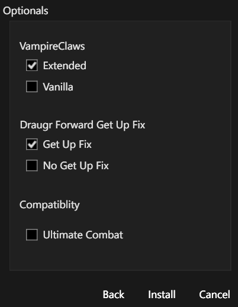

# Instalacja Precision - Creatures w NGVO

Krótka instrukcja dla konfiguracji:

- NGVO
- Mod Organizer 2
- Precision - Accurate Melee Collisions
- Precision - Creatures
- Pandora Behaviour Engine Plus

## Pre-install

1. W MO2 pracuj na osobnym profilu, np. `ngvo-plus`.
2. Traktuj tę instrukcję jako kolejny krok po instalacji `Precision - Accurate Melee Collisions`.
3. Upewnij się, że w tej konfiguracji działa już:
   - `SKSE`
   - `Address Library for SKSE Plugins`
   - `Precision - Accurate Melee Collisions`
   - `Pandora Behaviour Engine Plus`
4. Ten mod jest pluginem SKSE i jednocześnie zawiera modyfikacje behaviorów, więc po instalacji trzeba ponownie uruchomić Pandorę.
5. Nie zakładaj workflow z Nemesis, jeśli twój profil NGVO kończy generowanie behaviorów przez `Pandora Behaviour Engine Plus`.

## Instalacja

1. Pobierz mod `Precision - Creatures` do MO2:
   - https://www.nexusmods.com/skyrimspecialedition/mods/74887
2. Zainstaluj mod w MO2.
3. Jeśli w instalatorze widzisz ekran `Optionals`, wybierz:
   - `VampireClaws`: `Extended`
   - `Draugr Forward Get Up Fix`: `Get Up Fix`
   - `Compatibility`: zostaw `Ultimate Combat` odznaczone, jeśli tego moda nie ma w twojej liście



4. Jeśli masz na profilu `Ultimate Combat`, wtedy zaznacz odpowiednią opcję zgodności tylko dla tego konkretnego przypadku.
5. Włącz `Precision - Creatures` w lewym panelu MO2.

Punkt kontrolny: mod powinien być aktywny na liście po `Precision` albo przynajmniej w tej samej logicznej sekcji combat/animation fixes.

6. Sprawdź zawartość moda po instalacji.

Punkt kontrolny: to normalne, jeśli mod nie dodaje osobnego pluginu `esp/esl` i w prawym panelu MO2 nie pojawia się nowa pozycja. Kluczowe są pliki SKSE oraz dane behaviorów w samym modzie.

7. W executable w MO2 wybierz `Pandora Behaviour Engine Plus` i uruchom je.


8. W oknie Pandory sprawdź, że nowy mod jest uwzględniany przy generowaniu behaviorów.
9. Uruchom generowanie behaviorów.

Punkt kontrolny: jeśli Pandora kończy działanie bez błędu, NGVO ma już przetworzony nowy pakiet behaviorów razem z wcześniej zainstalowanym `Precision`.

Punkt kontrolny: w Pandorze niżej na liście = wyższy priorytet. Jeśli nie masz konkretnego konfliktu behaviorów, zostaw domyślną kolejność. Nie przesuwaj modu tylko dlatego, że jest nad `Precision`.

Przykładowy poprawny wynik z Pandory dla tej konfiguracji:

```text
Engine launched with configuration: Skyrim SE/AE. Do not exit before the launch is finished.
Waiting for preload to finish...
Preload finished.

Pandora Mod 1 : Precision Creatures - v.1.0.0
Pandora Mod 2 : Precision - v.1.0.0
Pandora Mod 3 : Assorted Behavior Fixes 3.2 - v.1.0.0
Pandora Mod 4 : Fix Vanilla Attack Annotation - v.1.0.0
Pandora Mod 5 : Unlocked First Person Combat A - v.1.0.0
Pandora Mod 6 : Animation Teleport Bug Fix - v.1.0.0
Pandora Mod 7 : GP Offset Movement Animation - v.1.0.0
Pandora Mod 8 : Grain Mill Animation Fix - v.1.0.0
Pandora Mod 9 : Payload Interpreter - v.1.0.0
Pandora Mod 10 : Some Creature Behavior Bug Fixes - v.1.0.0
Pandora Mod 11 : True Directional Movement - 360 Horse Archery - v.1.0.0
Pandora Mod 12 : True Directional Movement - Headtracking - v.1.0.0
Pandora Mod 13 : True Directional Movement - Procedural Leaning - v.1.0.0
Pandora Mod 14 : XPMSE Patch For Pandora - v.1.0.0
Pandora Mod 15 : Pandora Base - v.1.0.0

FNIS Mod 1 : FNIS_XPMSE_List

22 animations added to defaultfemale.
22 animations added to defaultmale.
1 animations added to firstperson.
3 animations added to werewolfbeastproject.

48 total animations added.

Launch finished in 3.39 seconds.
```

## Post-install

1. Po zakończeniu generowania nie pakuj automatycznie całego `Overwrite` do nowego moda.
2. W tej konfiguracji finalny output nadal powinien trafić do istniejącego moda `NGVO - Pandora Output`.
3. Ustaw `NGVO` w MO2 jako executable i uruchamiaj grę przez `RUN`.


4. W grze sprawdź zachowanie NPC w walce wręcz:
   - czy trafiają poprawniej na schodach i pochyłościach
   - czy lepiej korygują ataki góra-dół względem celu
   - czy nie ma T-pose ani uszkodzonych animacji
   - czy nie pojawiają się crashe przy starcie lub wejściu do walki

## Gotowe, jeśli

- `Precision` jest już aktywny na profilu
- `Precision - Creatures` jest aktywny w lewym panelu MO2
- Pandora kończy generowanie bez błędu
- gra startuje przez `SKSE`
- NPC trafiają stabilniej w sytuacjach, w których wcześniej machali nad albo pod celem
