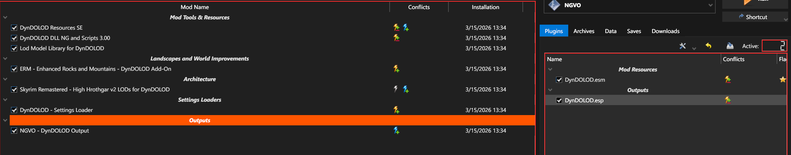

# Wyłączenie DynDOLOD w NGVO

1. Wyszukaj w MO2 `DynDOLOD`.
2. Wynik powinien wyglądać jak na screenie: po lewej `NGVO - DynDOLOD Output`, po prawej `DynDOLOD.esm` i `DynDOLOD.esp`.

3. W lewym panelu odznacz `NGVO - DynDOLOD Output`.
4. W prawym panelu odznacz `DynDOLOD.esp`.
5. `DynDOLOD.esm` zostaw włączony.

To wystarczy do szybkiego wyłączenia DynDOLOD na profilu NGVO.